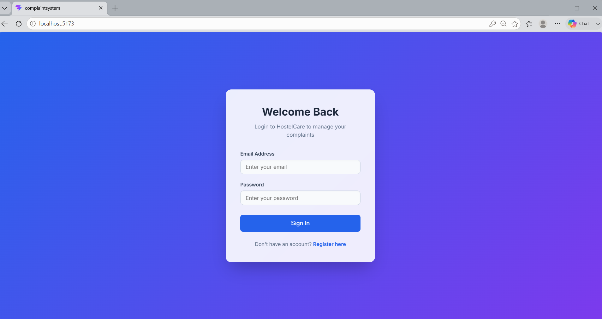
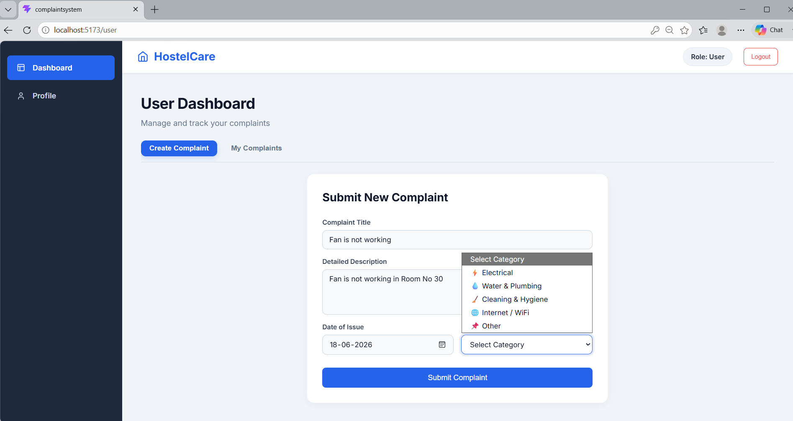
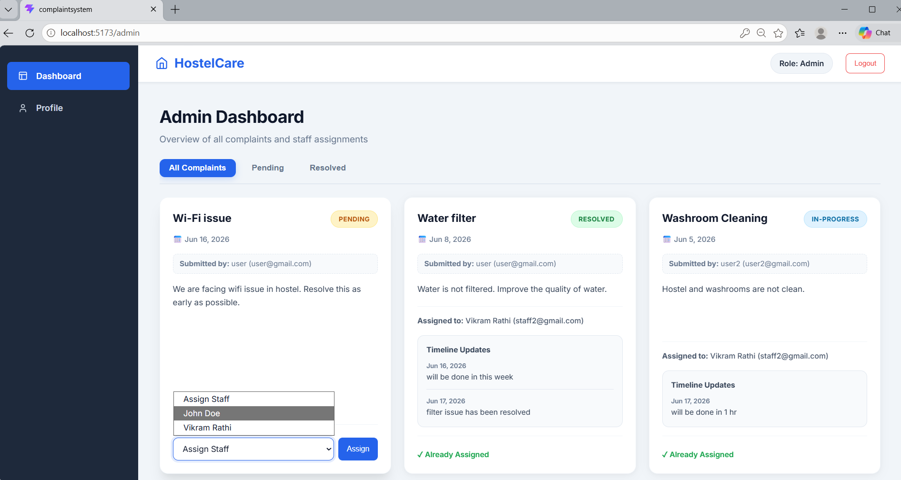
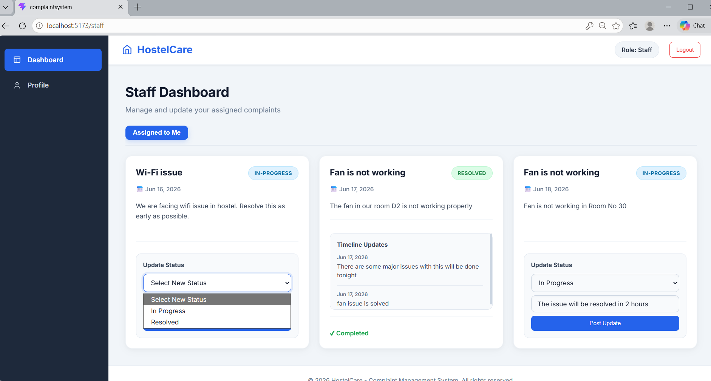
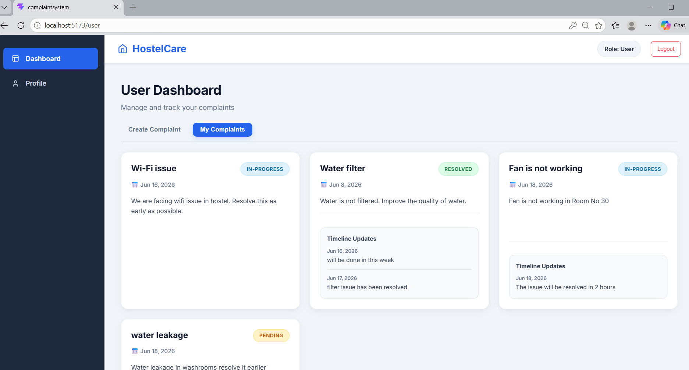

# HostelCare | Full-Stack Complaint Management System

A full-stack Complaint Management System developed using the MERN stack to manage the complete lifecycle of complaints, from issue reporting and staff assignment to progress tracking and final resolution. The platform serves as a centralized solution for improving communication, accountability, and operational efficiency within a hostel environment.

Built with role-based access control, JWT authentication, RESTful APIs, and MongoDB, the application demonstrates the design and implementation of a secure, scalable, and user-centric complaint management workflow.

---

## Live Demo

🌐 Frontend:
https://complaint-management-system-pi-ten.vercel.app

⚙️ Backend API:
https://cms-backend-ip4n.onrender.com

---

## Demo Credentials

### Admin

Email: admin@gmail.com

Password: Admin@123

### Staff

Email: staff@gmail.com

Password: Staff@123

Email: staff2@gmail.com

Password: Staff@123

### User

Create a new account to explore the user workflow.

---

## Features

### User

* Register and Login
* Submit complaints
* Track complaint status
* View complaint history
* View progress updates from staff

### Admin

* View all complaints
* Filter complaints by status
* Assign complaints to staff members
* Monitor complaint progress

### Staff

* View assigned complaints
* Update complaint status
* Add progress messages
* Resolve complaints

---

## Tech Stack

### Frontend

* React.js
* React Router DOM
* Vite
* CSS3
* React Toastify

### Backend

* Node.js
* Express.js
* JWT Authentication
* bcryptjs

### Database

* MongoDB Atlas
* Mongoose

---

## Screenshots

### Login Page

Secure JWT-based authentication system.

### User Dashboard

Users can submit complaints and track their status.

### Admin Dashboard

Administrators can assign complaints to staff members.

### Staff Dashboard

Staff members can manage and update assigned complaints.

### Complaint Tracking

Users can view complaint history and status updates.

---

## Authentication & Security

* JWT-Based Authentication
* Role-Based Authorization
* Protected Routes
* Password Hashing with bcryptjs
* Environment Variables using .env
* Session Expiration Handling
* Secure MongoDB Connection

---

## Project Structure

Complaint-System/

├── Backend/

│   ├── controllers/

│   ├── middleware/

│   ├── models/

│   ├── routes/

│   └── server.js

│

├── Frontend/

│   ├── src/

│   │   ├── components/

│   │   ├── pages/

│   │   ├── services/

│   │   └── styles/

│   └── vite.config.js

│

├── screenshots/

├── README.md

└── .gitignore

---

## Complaint Workflow

User

↓

Create Complaint

↓

Admin Reviews Complaint

↓

Assigns Staff Member

↓

Staff Updates Status

↓

Resolved

---

## Environment Variables

### Backend (.env)

MONGO_URI=your_mongodb_connection_string

JWT_SECRET=your_secret_key

PORT=3001

### Frontend (.env)

# Local Development
VITE_API_URL=http://localhost:3001/api

# Production
VITE_API_URL=https://cms-backend-ip4n.onrender.com/api

---

## Installation

### Clone Repository

git clone https://github.com/akanksha-bhanage/Complaint-Management-System.git

cd Complaint-System

### Backend Setup

cd Backend

npm install

npm start

### Frontend Setup

cd Frontend

npm install

npm run dev

---

## Learning Outcomes

This project strengthened my understanding of:

* React Component Architecture
* React Hooks
* State Management
* Props and Component Reusability
* React Router
* REST APIs
* JWT Authentication
* Role-Based Access Control
* MongoDB and Mongoose
* Backend API Design
* Error Handling
* Environment Variables
* Git & GitHub Workflow
* Deployment using Vercel and Render
* Production Readiness Practices

---

## Author

Akanksha Bhanage

B.Tech CSE Student

Full Stack Developer
